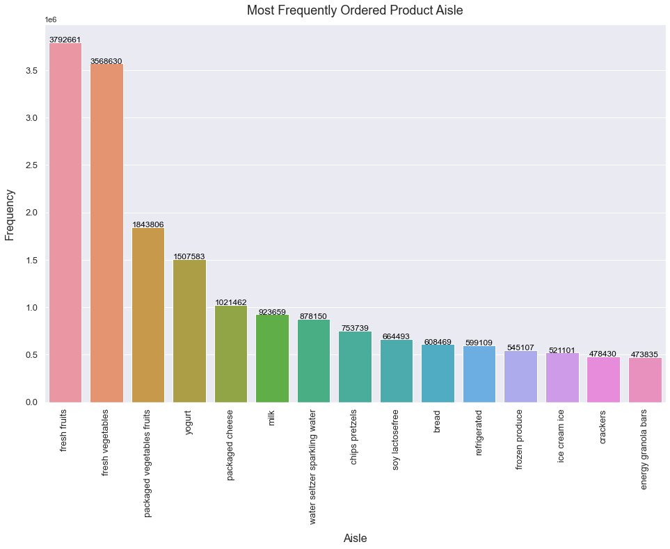
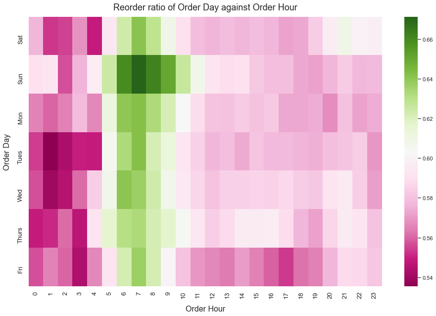

# Instacart Data Analysis

## Introduction

Instacart data analysis aims to analyse existing reorder data that Instacart has publicly shared.

Information Slides: [Click here to access Google Slides](https://docs.google.com/presentation/d/1hr-rEYj1m-KKYy8eLZi367pdVnCHD52HrK0oC7X5jHQ/edit?usp=sharing)

Notebook: [Click here to access Python Notebook](https://github.com/jason-beh/instacart-analysis/blob/master/Instacart%20Data%20Analysis.ipynb)

## Outcomes

- Analysed over 3 million records using Python

- Provided 2 data driven recommendations and plotted 8 visualizations

## Screenshots

